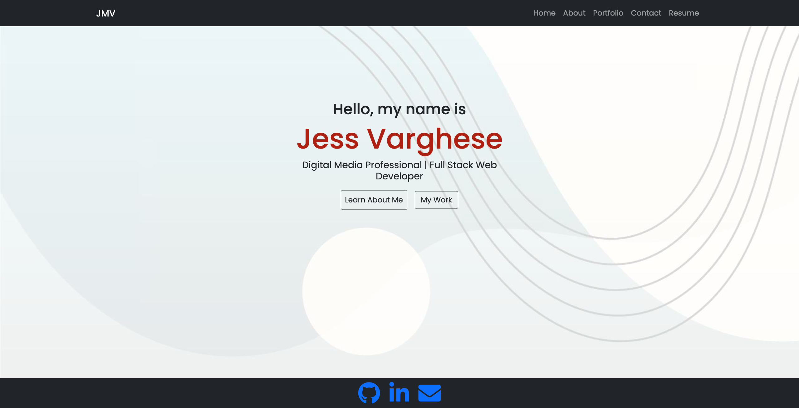

# Jess Varghese React Portfolio

  

  )

 

  ## Description
  This portfolio is built using react and features my Github projects, technical skills, and resume.
  

  [Deployed application](https://jessvarghese.github.io/react-portfolio/)

  ## Table of Contents

  * [Usage](#usage)
  * [Visuals](#visuals)
  * [License](#license)
  * [Technologies](#technologies)
  * [Questions](#questions)
 

  ## Usage
    gh repo clone JessVarghese/react-portfolio
    npm start

  ## Visuals

  [VIDEO DEMO](https://watch.screencastify.com/v/kTtMhBkWnd5RYzqvL6a5)

   

  ## License
  This project operates under the [MIT](https://choosealicense.com/licenses/MIT/) license.

  ## Technologies
 * React
 * React-Boostrap
 * Fontawesome
 * React Router
 * animate.css
 * Getform (contact form submissions)

## Questions
  If you have any questions about the repo, open an issue:
  * Github: https://github.com/JessVarghese/react-portfolio